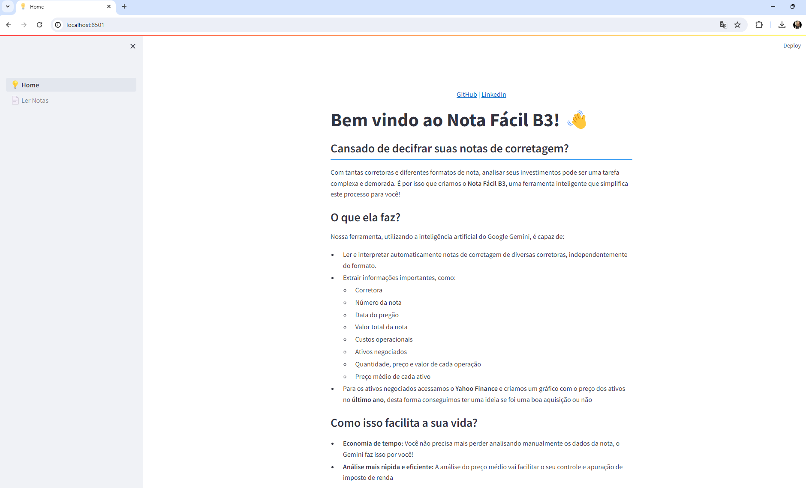
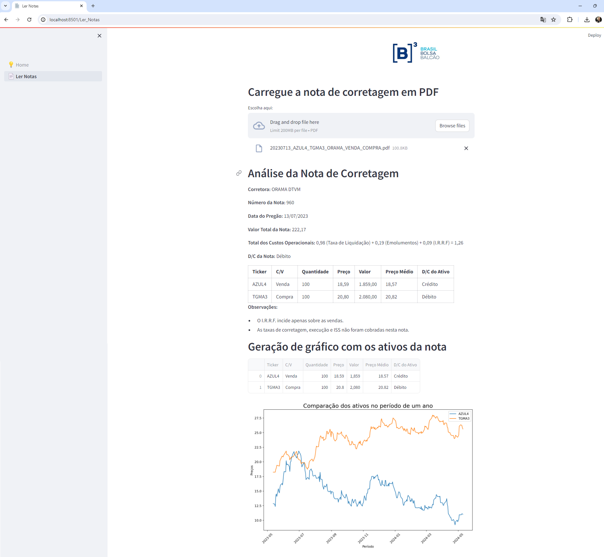

# Nota Fácil B3: Analise suas notas da B3 sem complicação

Página Home:
<div align="center">
    
</div>

Página Ler Notas:
<div align="center">
    
</div>


## Saiba como funciona

Clique para assistir ao vídeo que demostra o passo a passo:

[](https://www.youtube.com/watch?v=cD14drGuj9s)

## Sobre o Projeto
**Nota Fácil B3** é um aplicativo que utiliza a inteligência artificial do Google Gemini para ler e interpretar automaticamente notas de corretagem de diversas corretoras, independentemente do formato. Ele extrai os detalhes da nota, permite exportar em CSV e mostra um gráfico com o preço dos ativos no último ano utilizando como fonte de informação o Yahoo Finance.

Este projeto foi desenvolvido para o Desafio da Imersão de IA da Alura em parceira com o Google: https://www.alura.com.br/imersao-ia-google-gemini

## Tecnologias Utilizadas

* **Google Generative AI (Gemini):** Modelo de IA multi modal do Google DeepMind. Ele é capaz de entender diferentes tipos de entrada, como texto, código, imagens e áudio, e combinar essas informações para gerar praticamente qualquer tipo de saída, como texto, código ou legendas para imagens.

* **Streamlit:** Framework de código aberto criado para ajudar cientistas de dados a colocarem seus projetos em produção sem a necessidade de conhecer ferramentas de front-end ou de deploy de aplicações. Cria aplicativos web interativos de forma simples e rápida.

## Como Usar

1. **Clonar o repositório:**

```bash
https://github.com/crisansou/nota-facil-b3.git
```

2. **Instalar as dependências:**

```bash
pip install -r requirements.txt
```

3. **Configurar a chave de API:**

Gere uma chave de API do Google Generative AI e mude o valor da variável `API_KEY` no arquivo `nota_corretagem_view.py` pela sua chave.

4. **Executar o aplicativo:**

```bash
streamlit run 💡Home.py
```

5. **Acessar o aplicativo:** 

Acesse o endereço `http://localhost:8501` no seu navegador preferido.

## Observações

Este projeto ainda está em construção, foi realizada apenas uma prova de conceito utilizando notas de corretagem da Órama e CM Capital, por isso erros podem ser encontrados. Fique à vontade para contribuir com o projeto e apontar melhorias/correções!